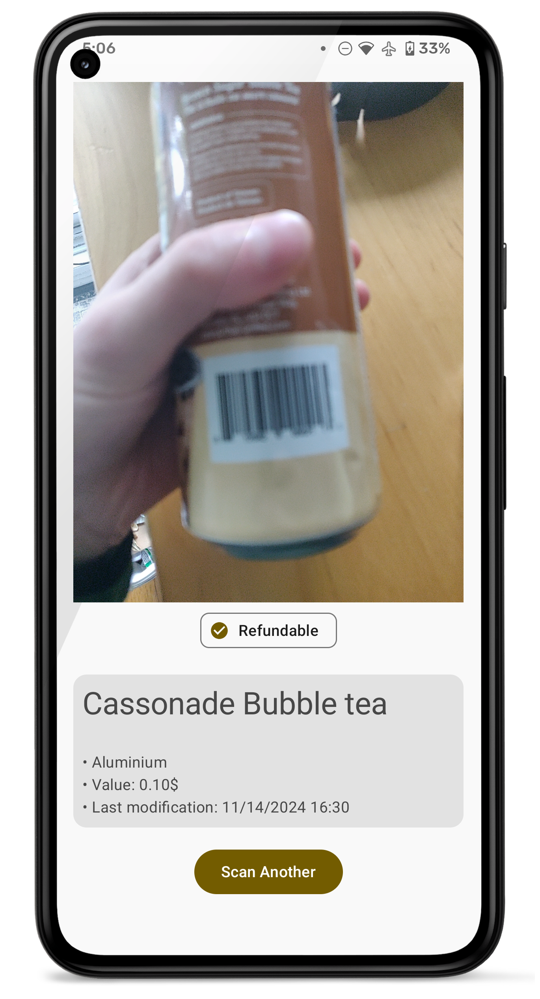

# Consignaction Quebec Scanner

A simple app that tells you whether you get a refund or not for a
beverage container in Quebec by scanning the barcode on said beverage!

Under the hood, the app uses the official database from
[here](https://consignaction.ca/partenaires/detaillants/boite-a-outils-des-detaillants-partenaires/).

The app is based on https://github.com/myofficework000/QRCodeScanner/.

## Screenshots

